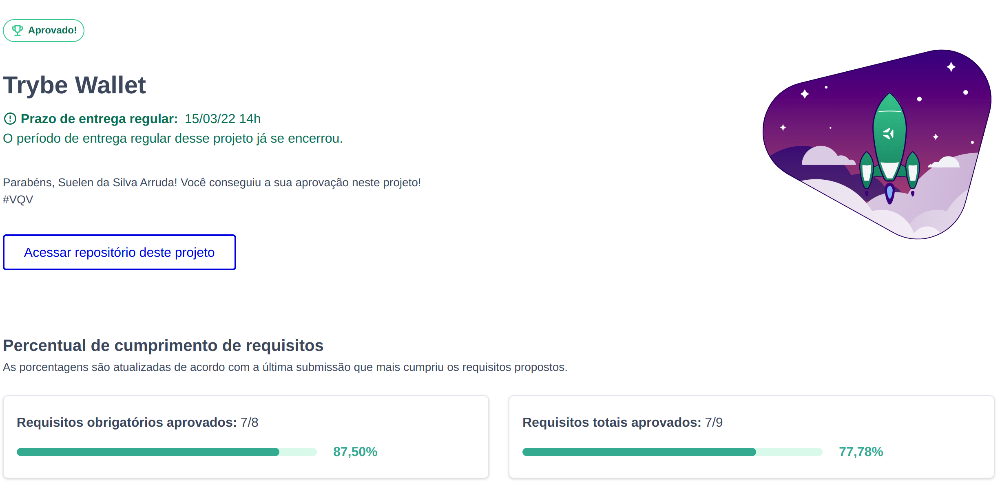

# Trybe Wallet Project

##### Projeto desenvolvido durante a viagem ao Brasil. A emoção de aprender algo como Redux, ainda engatinhando no React, manejar uma viagem de quase 24 horas tendo um prazo para cumprir, é indescritível! Me faltam palavras para descrever como foi! Creio que a palavra _equilibrista_ define muito bem!! :sweat_smile:
 

## Habilidades Desensolvidas

- Criar um store Redux em aplicações React

- Criar reducers no Redux em aplicações React

- Criar actions no Redux em aplicações React

- Criar dispatchers no Redux em aplicações React

- Conectar Redux aos componentes React

- Criar actions assíncronas na aplicação React que faz uso de Redux.

## O que foi desenvolvido

 Aplicação desenvolvida em React usando Redux como ferramenta de manipulação de estado.
 Através dessa aplicação, é possível realizar as operações básicas de criação e manipulação de um estado de redux. 
 Foi desenvolvida uma carteira de controle de gastos com conversor de moedas, ao utilizar essa aplicação um usuário é capaz de:

- Adicionar, remover e editar um gasto;
- Visualizar uma tabelas com seus gastos;
- Visualizar o total de gastos convertidos para uma moeda de escolha;

---

## Documentação da API de Cotações de Moedas

A página web irá consumir os dados da API do <a href='https://economia.awesomeapi.com.br/json/all'>awesomeapi API<a/> de Cotações para realizar a busca de câmbio de moedas.
 

##  Instruções

1 - Clone o repositório, instale as dependências e inicialize o projeto

- Instale as dependências:
  - `npm install`
- Inicialize o projeto:
  - `npm start` (uma nova página deve abrir no seu navegador com um texto simples)

## Gif do projeto

## Stacks utilizada

 
  
  

   

  

   

  

    

  

 

 
## Status do projeto
 
 
### 🔗 Links

